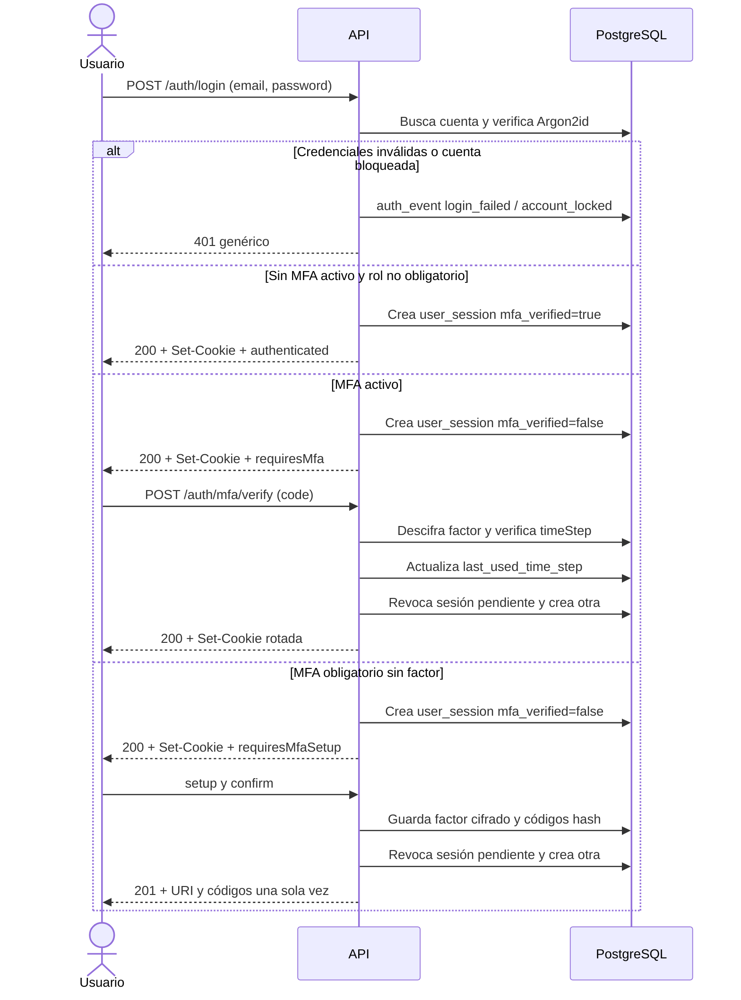
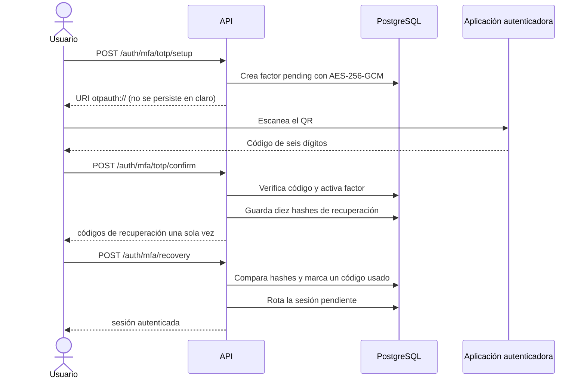

# Autenticación y autorización

Este documento describe la Fase 1 de autenticación y autorización de `koffisoft_api`. La API usa sesiones server-side, cookies HttpOnly, TOTP, códigos de recuperación, roles y permisos. El módulo usa las tablas ya existentes; no agrega ni modifica migraciones.

## Decisiones de seguridad

- Las contraseñas y los códigos de recuperación se almacenan con Argon2id. La configuración inicial es `memoryCost=19456 KiB`, `timeCost=2` y `parallelism=1`. El servicio verifica hashes con la biblioteca nativa y usa `needsRehash` para actualizar hashes válidos cuando cambie la política. Para un correo inexistente consume un hash Argon2id antes de responder.
- El error de login es genérico (`Credenciales inválidas.`), sin indicar si el correo existe, está bloqueado o tiene una contraseña incorrecta. Después de `AUTH_LOGIN_MAX_ATTEMPTS` fallos se actualizan `failed_login_attempts`, `locked_at` y `locked_until` en `users`.
- Cada sesión comienza con 32 bytes aleatorios (`256 bits`) codificados como Base64URL. Solo el SHA-256 del token queda en `user_sessions`; el valor de la cookie nunca se audita ni se registra. La sesión tiene expiración absoluta y por inactividad.
- La cookie es HttpOnly, `Path=/`, `SameSite=Lax` y usa `Secure` según `COOKIE_SECURE`. Con `COOKIE_SECURE=true`, la configuración añade el prefijo `__Host-` si el nombre no lo tenía. `Lax` mantiene protección CSRF para mutaciones y evita romper el uso normal del panel cuando el frontend y la API tienen orígenes distintos pero pertenecen al mismo sitio; la lista exacta de orígenes y la comprobación CSRF agregan una defensa independiente.
- Login, verificación MFA y las operaciones de recuperación tienen límites de `@nestjs/throttler`. El almacenamiento predeterminado es local al proceso; un despliegue con varias réplicas debe sustituirlo por un almacenamiento distribuido antes de considerarlo un límite global.
- TOTP usa los valores interoperables de las aplicaciones autenticadoras: SHA-1, seis dígitos y pasos de 30 segundos. La API acepta el paso actual y uno anterior o siguiente, pero solo puede consumir una vez cada `timeStep`; la actualización condicional de `last_used_time_step` evita carreras y replay.
- El secreto TOTP se genera en la API, se cifra con AES-256-GCM (`iv` de 12 bytes y tag de 16 bytes) y se guarda en `user_mfa_factors`. La URI `otpauth://` se devuelve únicamente durante el alta para que el frontend cree el QR. No se guarda la URI ni se escribe el secreto en logs o auditoría.
- El alta genera diez códigos de recuperación aleatorios. El usuario los recibe una sola vez y en la base solo quedan hashes Argon2id y `used_at`. Regenerarlos invalida los anteriores.
- Los roles de `MFA_REQUIRED_ROLES` (`owner,admin,manager` por defecto) no pueden usar el resto de la API mientras no tengan un factor activo. Solo pueden completar `mfa/totp/setup` y `mfa/totp/confirm`. Una sesión pendiente de MFA solo puede completar TOTP o recuperación.
- Las mutaciones con una cookie de sesión deben traer `Origin` o `Referer` cuyo origen coincida exactamente con `CORS_ORIGIN`. Sin cookie se permite un cliente no navegador como `curl` sin esos encabezados para iniciar sesión; con cookie, la ausencia de ambos encabezados se rechaza. CORS solo habilita credenciales para los orígenes configurados.
- `auth_events` registra resultados de login, bloqueos, MFA, recuperación, sesiones, cambios de contraseña y alta/baja de factores con IP, agente y request id. El esquema no tiene un tipo `logout` separado: logout y revocaciones se registran como `session_revoked` con una razón no sensible.

## Flujo de login y MFA



El token se rota al iniciar sesión si ya había una cookie, al completar TOTP, al usar recuperación, al confirmar el alta, al desactivar MFA y al cambiar la contraseña. La cookie anterior queda revocada en la base; las rotaciones durante una sesión pendiente conservan su expiración absoluta original.

## Alta y recuperación de MFA



Para desactivar MFA se exige la contraseña actual y un código TOTP de la sesión autenticada. La acción elimina los códigos de recuperación, revoca las demás sesiones y rota la sesión actual. Un rol incluido en `MFA_REQUIRED_ROLES` queda nuevamente restringido a la inscripción si desactiva su único factor.

## Endpoints

Todos los cuerpos se validan con `ValidationPipe` global, `whitelist=true`, `forbidNonWhitelisted=true` y transformación habilitada. Los errores HTTP tienen esta forma:

```json
{
  "statusCode": 401,
  "error": "Unauthorized",
  "message": "Credenciales inválidas.",
  "path": "/auth/login",
  "timestamp": "2026-10-04T18:00:00.000Z"
}
```

### Sesión

- `POST /auth/login`: valida email y contraseña, aplica bloqueo, crea una sesión y devuelve `requiresMfa` o `requiresMfaSetup` junto con la expiración. La sesión se entrega en cookie, no en JSON.
- `POST /auth/mfa/verify`: solo para una sesión pendiente con factor activo. Acepta seis dígitos, consume el paso TOTP y rota la cookie.
- `POST /auth/mfa/recovery`: solo para una sesión pendiente. Consume exactamente un código de recuperación y rota la cookie.
- `POST /auth/logout`: público e idempotente; revoca la cookie recibida si corresponde y siempre la limpia.
- `POST /auth/logout-all`: requiere una sesión autenticada, revoca todas las sesiones del usuario y limpia la cookie actual.
- `GET /auth/me`: devuelve usuario, roles, permisos efectivos y estado MFA. Nunca devuelve hashes, secretos, tokens ni códigos.

### TOTP y códigos de recuperación

- `POST /auth/mfa/totp/setup`: crea un factor pendiente y devuelve `{ label, uri, status }`. Es la ruta permitida para un rol que debe completar MFA.
- `POST /auth/mfa/totp/confirm`: confirma el factor pendiente, lo activa y devuelve diez códigos de recuperación en claro solo en esa respuesta.
- `POST /auth/mfa/totp/disable`: exige `{ password, code }`, desactiva el factor y revoca sesiones adicionales.
- `POST /auth/mfa/recovery-codes`: exige `{ password, code }`, invalida los códigos anteriores y devuelve diez nuevos una sola vez.

### Contraseña

- `POST /auth/password`: exige `{ currentPassword, newPassword }`, requiere una sesión plenamente autenticada, guarda el nuevo hash, actualiza `password_changed_at`, revoca otras sesiones y rota la actual.

## Autorización

`SessionGuard` es global y carga el usuario y sus permisos efectivos desde `user_roles -> roles -> role_permissions -> permissions`, considerando solo roles y permisos activos. `PermissionGuard` también es global, pero solo actúa cuando una ruta declara permisos:

```ts
@RequirePermissions('users.read', 'users.update')
@Get(':id')
getUser() {
  // Todos los permisos declarados deben estar en la unión efectiva del usuario.
}
```

`@Public()` excluye una ruta del guard de sesión. Los códigos de auth y administración de acceso del seed inicial son `auth.sessions.read`, `auth.sessions.revoke`, `auth.mfa.manage`, `auth.password.change`, `users.read`, `users.create`, `users.update`, `users.disable`, `roles.read`, `roles.manage`, `permissions.read`, `permissions.manage` y `audit_logs.read`; el seed también contiene los códigos de negocio correspondientes a las fases posteriores. Las rutas de autoservicio de esta fase validan la propiedad de la sesión y no inventan un endpoint administrativo de usuarios.

## Configuración y rotación de llave

`MFA_ENCRYPTION_KEY` debe ser Base64 de exactamente 32 bytes. `MFA_KEY_VERSION` identifica la versión de la llave usada para cifrar factores; si una fila tiene otra versión, la API falla de forma explícita en vez de intentar descifrarla con una llave incorrecta. La rotación futura debe descifrar con la versión anterior y volver a cifrar en una migración operacional controlada, conservando `key_version` actualizado; nunca se deben imprimir secretos.

Las sesiones usan:

- `SESSION_IDLE_MINUTES`: expiración desde la última actividad.
- `SESSION_ABSOLUTE_HOURS`: límite absoluto desde la creación.
- `SESSION_COOKIE_NAME`: nombre base; con cookie segura se normaliza a `__Host-<nombre>`.
- `COOKIE_SECURE`: `false` solo para HTTP local; `true` detrás de HTTPS.
- `CORS_ORIGIN`: lista separada por comas de orígenes HTTP(S) exactos, sin `*` ni rutas.

## Pruebas

Las pruebas unitarias cubren Argon2id, AES-256-GCM, vectores de seis dígitos de RFC 6238, guard de permisos y CSRF. `src/auth/auth.e2e.spec.ts` usa `Fastify.inject` y se salta si no existe `TEST_DATABASE_URL`; cuando se habilita, requiere una base de pruebas aislada con el esquema y seed aplicados y limpia sus datos al terminar.

## Fuentes

- [OWASP Password Storage Cheat Sheet](https://cheatsheetseries.owasp.org/cheatsheets/Password_Storage_Cheat_Sheet.html): Argon2id, parámetros y rehash.
- [OWASP Authentication Cheat Sheet](https://cheatsheetseries.owasp.org/cheatsheets/Authentication_Cheat_Sheet.html): respuestas genéricas, throttling y bloqueo.
- [OWASP Session Management Cheat Sheet](https://cheatsheetseries.owasp.org/cheatsheets/Session_Management_Cheat_Sheet.html): CSPRNG, renovación, `HttpOnly`, `Secure`, `SameSite`, timeout y `__Host-`.
- [OWASP Multifactor Authentication Cheat Sheet](https://cheatsheetseries.owasp.org/cheatsheets/Multifactor_Authentication_Cheat_Sheet.html): alta, recuperación y protección de MFA.
- [OWASP Cross-Site Request Forgery Prevention Cheat Sheet](https://cheatsheetseries.owasp.org/cheatsheets/Cross-Site_Request_Forgery_Prevention_Cheat_Sheet.html): `Origin`, `Referer` y defensa en profundidad.
- [OWASP ASVS 5, requisitos generales de MFA](https://cornucopia.owasp.org/taxonomy/asvs-5.0/06-authentication/05-general-multi-factor-authentication-requirements): códigos de un solo uso, CSPRNG y lifetime.
- [RFC 6238](https://www.rfc-editor.org/rfc/rfc6238.html): TOTP, paso de 30 segundos, tolerancia de reloj y rechazo de reutilización.
- [NestJS Validation](https://docs.nestjs.com/application/validation), [NestJS Cookies](https://docs.nestjs.com/techniques/cookies), [NestJS CSRF](https://docs.nestjs.com/security/csrf) y [NestJS OpenAPI](https://docs.nestjs.com/v11/openapi/introduction): integración HTTP y documentación.
- [@fastify/cookie](https://github.com/fastify/fastify-cookie), [@nestjs/throttler](https://github.com/nestjs/throttler), [argon2](https://github.com/ranisalt/node-argon2) y [otplib](https://otplib.yeojz.dev/): dependencias y APIs usadas.
