# Koffi-Soft — diseño de base de datos

## Decisión final

Se recrea la base desde cero. El SQL legacy se usa como inventario de conceptos y flujos, no como esquema ni como fuente automática de datos.

La alternativa elegida combina:

- La separación operativa de **r1-operaciones**: menú, variantes, comandas por estación, recetas, movimientos de inventario, caja y DTE.
- La experiencia comercial de **r1-clientes-eventos**: espacios, reservas con duración, snapshots de contacto, cotizaciones versionadas y anticipos.
- La disciplina de **r1-arquitectura**: UUIDv7 para entidades internas, dinero con numeric, FK reales, auditoría, llaves y secretos de aplicación fuera de PostgreSQL, ciphertext TOTP protegido y documentos fiscales inmutables.
- La reducción de alcance defendida en las tres propuestas de ronda 2 para operar primero una sola sede sin construir un ERP, CMS, CRM o SaaS multiempresa.

La base inicial incluye 78 tablas, 2 vistas y 36 enums. La cifra no busca reproducir las 32 tablas legacy: varias tablas nuevas separan responsabilidades que antes estaban mezcladas, y otras capacidades avanzadas se dejan para una segunda etapa.

## Investigación operativa y normativa

La Ruta Panorámica se comporta como un destino gastronómico, no como una cafetería urbana de paso: la cobertura local describe un corredor de unos nueve kilómetros con restaurantes, terrazas, vistas al Lago de Ilopango y oferta que va de desayunos y café a carnes y almuerzos. [Ruta Panorámica y restaurantes con vista al Lago de Ilopango](https://www.elsalvador.com/turismo/rutas-y-aventuras/turismo-ministerio-de-restaurantes-san-salvador-el/1239874/2025/)

Negocios comparables venden la experiencia a turistas nacionales y extranjeros, combinan café con menú familiar y reciben bodas, cumpleaños y capacitaciones. [Los Volcanes Bistro Café](https://losvolcanescafe.com/) muestra ese patrón; [Il Buongustaio](https://www.ilbuongustaiosv.com/eventos) publica capacidades por espacio, desayunos/brunch, bodas, cenas privadas, reuniones y un formulario que solicita fecha, horario, invitados y necesidades adicionales. [El Patio Restaurante y Recepciones](https://www.elpatiorestaurantes.com/) confirma la demanda de salones, jardines, eventos sociales y corporativos.

El modelo, por tanto, contempla:

- Picos de sábado, domingo, feriados y temporadas sin asumir una cantidad fija de ventas.
- Desayuno con disponibilidad por horario, almuerzo, café de especialidad, bebidas y postres.
- Espacios con valor comercial: interior, terraza, mirador, jardín y salón privado.
- Servicio en mesa, para llevar y ventas asociadas a eventos.
- Comandas separadas para cocina, café/barra y postres.
- Recetas con insumos, unidades, lotes, vencimientos, proveedores múltiples y mermas.
- Reservas de mesa y eventos privados con bloqueo temporal de recursos.
- Caja, varios pagos por orden y reportes derivados de órdenes, pagos, inventario y personal.

Como referencia funcional, los POS de restaurantes actuales tratan los modificadores y el nombre de cocina como parte de la configuración del menú, y separan la preparación por tickets/KDS y los reportes operativos. [Toast: configuración de menú y modificadores](https://support.toasttab.com/en/article/Menu-Best-Practices-for-Diners), [Toast: Kitchen Display System](https://pos.toasttab.com/hardware/kitchen-display-system), [Toast: reportes](https://support.toasttab.com/en/article/Getting-Started-with-Analytics-and-Reports). La división de cuentas por persona o línea existe en POS comerciales, pero se difiere: para el primer lanzamiento bastan varios pagos sobre una orden. [Square: dividir pagos y cuentas](https://squareup.com/help/us/en/article/8165-split-a-payment-and-check-with-square-for-restaurants)

### Normativa que condiciona el modelo

- La tasa general del IVA se siembra como 0.130000 y se conserva por vigencia en tax_rates; no se codifica como constante en NestJS. El artículo 54 de la Ley del IVA indica 13 % sobre la base imponible. [Ley del IVA, artículo 54](https://transparencia.mh.gob.sv/downloads/pdf/DC5828.pdf)
- El DTE es un límite fiscal independiente de la orden: se conservan código de generación, número de control, sello de recepción, estado, archivo firmado, versión legible, líneas, pagos y eventos de transmisión/rechazo/contingencia/invalidación. Hacienda establece que el DTE se firma antes de entregarlo y que deben entregarse el archivo DTE y su versión legible; el sello de recepción da validez fiscal al documento transmitido. [Reforma de facturación electrónica del Ministerio de Hacienda](https://www.mh.gob.sv/reformas-al-codigo-tributario-relativas-a-la-facturacion-electronica-documentos-tributarios-electronicos-dte/), [guía oficial de emisión](https://www.mh.gob.sv/wp-content/uploads/2023/10/Guia-r%C3%A1pida-emitir-una-Factura-en-la-plataforma-Sistema-de-Facturaci%C3%B3n.pdf), [normativa técnica DTE](https://transparencia.mh.gob.sv/downloads/pdf/700-DGII-MN-2023-002.pdf)
- El modelo permite DUI, NIT, NRC, pasaporte y carné de residencia sin exigirlos en una reserva normal. Hacienda indica que el DUI puede reemplazar o registrarse como NIT para personas naturales salvadoreñas adultas, que los NIT físicos conservan validez y que extranjeros pueden identificarse con pasaporte o carné de residencia. [NIT Digital y DUI/NIT](https://www.mh.gob.sv/servicios/inscripcion-modificacion-o-reposicion-de-nit-persona-natural/), [guía de orientación NIT=DUI](https://www.mh.gob.sv/guia-de-orientacion-nitdui/)
- La propina es un flujo separado del descuento y del IVA. La propuesta de reforma que suele citarse establece hasta 10 %, información previa y reducción/anulación por inconformidad, pero no se convierte aquí en un CHECK legal rígido: la versión vigente debe confirmarse con contador/asesor. Sí se registra aceptación, ajuste, distribución y pago. El MTPS informó en 2026 que las propinas pertenecen a los trabajadores y que la entrega debe hacerse oportunamente, con plazo máximo de 15 días en la comunicación citada. [Propuesta legislativa sobre propina](https://www.asamblea.gob.sv/sites/default/files/documents/correspondencia/7AF30DAC-923C-4D8D-AD30-49D94C7832D1.pdf), [MTPS: inspección laboral y propinas](https://www.mtps.gob.sv/2026/07/31/despliegue-nacional-de-inspeccion-laboral-durante-las-vacaciones-agostinas/)
- Para el cliente, los datos fiscales son opcionales hasta que el tipo de DTE o la operación los requiera. El negocio sí conserva sus propios identificadores tributarios y NRC en businesses.

Fecha de revisión web: 3 de octubre de 2026.

## Autenticación, MFA y autorización

La autenticación del panel se implementa desde el inicio con sesiones server-side, cookies HttpOnly y TOTP. La contraseña se almacena únicamente como hash Argon2id; no se cifra ni se conserva en claro. OWASP recomienda Argon2id como algoritmo adaptativo para contraseñas y exige comparar los hashes con funciones seguras. [OWASP Password Storage Cheat Sheet](https://cheatsheetseries.owasp.org/cheatsheets/Password_Storage_Cheat_Sheet.html) y [OWASP Authentication Cheat Sheet](https://cheatsheetseries.owasp.org/cheatsheets/Authentication_Cheat_Sheet.html).

- `user_sessions` guarda solo el hash hexadecimal SHA-256 del token opaco, fechas de creación/expiración/revocación, último uso, IP, agente de usuario, estado de MFA y motivo de revocación. El token que viaja en cookie nunca se persiste.
- `user_mfa_factors` usa `factor_type = 'totp'` y almacena ciphertext, nonce/IV de 12 bytes, auth tag de 16 bytes y `key_version`. El secreto se cifra con AES-256-GCM en la frontera de aplicación; la llave de aplicación no vive en PostgreSQL.
- `last_used_time_step` se actualiza en la misma transacción que la verificación para impedir aceptar dos veces el mismo paso TOTP. RFC 6238 recomienda un paso de 30 segundos, una ventana de retraso acotada y no aceptar el segundo intento del mismo OTP; la semilla y las claves deben protegerse. [RFC 6238](https://www.rfc-editor.org/rfc/rfc6238.html).
- `user_mfa_recovery_codes` guarda solo el hash de cada código y `used_at`; la recuperación es de un solo uso. ASVS exige uso único, vida útil definida, generación con CSPRNG y posibilidad de revocar factores. [OWASP MFA Cheat Sheet](https://cheatsheetseries.owasp.org/cheatsheets/Multifactor_Authentication_Cheat_Sheet.html) y [OWASP ASVS 5.0, requisitos MFA](https://cornucopia.owasp.org/taxonomy/asvs-5.0/06-authentication/05-general-multi-factor-authentication-requirements).
- `users.failed_login_attempts`, `locked_at`, `locked_until` y `auth_events` dejan la frontera de bloqueo, fallos de contraseña/2FA, cambios de contraseña/factor y revocaciones lista para rate limiting y auditoría. El contador y las ventanas de bloqueo los gobierna la aplicación.
- `audit_logs` conserva acciones de negocio; `auth_events` conserva hechos de autenticación para no mezclar secretos operativos con auditoría funcional.
- Los roles son editables por `roles`, `permissions` y `role_permissions`. El código del permiso es estable y se usa en la autorización de la API; `user_roles` permanece como asignación a nivel de negocio. No se agrega `location_id` todavía: el MVP opera una sede y no existe un contrato aprobado de autorización por sede.

OWASP también recomienda no poner tokens de autenticación en `localStorage`; la sesión se transportará mediante cookie HttpOnly, Secure y SameSite, con protección CSRF y rate limiting implementados en la capa HTTP cuando se construya el módulo de autenticación. [OWASP Session Management Cheat Sheet](https://cheatsheetseries.owasp.org/cheatsheets/Session_Management_Cheat_Sheet.html).

## Convenciones

### Nombres y Prisma

- Tablas físicas en inglés, plural y snake_case: orders, order_lines, dte_documents.
- Columnas en inglés, singular y snake_case; FK con sufijo _id.
- Modelos Prisma en singular/PascalCase (Order, DteDocument) y campos camelCase mediante @map/@@map solo cuando haga falta.
- No se usa el prefijo tb, nombres españoles ni abreviaturas ambiguas. Se conservan solamente acrónimos de dominio conocidos: DTE, DUI, NIT y NRC.
- relationMode = foreignKeys: PostgreSQL es la autoridad de integridad, no solo Prisma.
- Prisma 7 puede hacer `db pull` sobre este esquema, pero reportará advertencias para CHECK, EXCLUDE, comentarios y algunos índices expresivos; esas piezas se conservan en migraciones SQL personalizadas y no se espera que el `schema.prisma` generado las reproduzca por completo. [Prisma 7: introspección y funciones no soportadas](https://www.prisma.io/docs/orm/v7/prisma-schema/introspection)

### Identidad, fechas y dinero

- Entidades de negocio usan uuid con uuidv7() por defecto en PostgreSQL 18; el número visible de orden usa identidad separada. PostgreSQL 18 incorpora generación nativa de UUIDv4 y UUIDv7. [PostgreSQL 18: UUID](https://www.postgresql.org/docs/18/datatype-uuid.html), [funciones UUID](https://www.postgresql.org/docs/18/functions-uuid.html)
- El generation_code de un DTE es independiente del PK y se genera con UUIDv4 en el ejemplo; su formato final debe seguir el catálogo técnico vigente de Hacienda.
- Instantes reales: timestamptz(3). Fecha comercial local: date. Horario semanal: time.
- La sede usa America/El_Salvador; la API calcula business_date en esa zona y guarda instantes con zona.
- Dinero: numeric(14,2). Tasas: fracción (0.13). Cantidades y costos de inventario: numeric(14,6). Moneda inicial: USD.
- Los precios públicos incluyen una bandera includes_tax. Las order_lines conservan precio base, nombres, variante, SKU, descuento, base imponible, tasa y total; las event_quote_lines conservan sus labels y los DTE su description. La descripción comercial no se copia en todas las líneas históricas.

### Historial, seguridad y borrado

- Los maestros se desactivan con active; no se borran si ya fueron usados.
- Órdenes cerradas, pagos, movimientos de inventario, sesiones de caja, cotizaciones aceptadas, DTE y auditoría no se eliminan ni se editan para cambiar la historia: se anulan, revierten o generan un nuevo documento.
- Contraseñas, tokens de sesión, tarjetas, certificados y claves privadas nunca se almacenan en claro. PostgreSQL conserva hashes de contraseña/token, y solo ciphertext TOTP con su IV, auth tag y versión de llave; el SQL contiene material ficticio de demostración.
- Los certificados y claves DTE se referencian por dte_certificate_ref/dte_private_key_ref; el secreto vive en un gestor externo.
- DUI/NIT/pasaporte de clientes son opcionales y sensibles. Si se necesitan, se guardan en customer_documents; no se piden para una reserva normal.

### Restricciones de negocio

- CHECK valida importes no negativos, cantidades positivas, rangos de fechas y coherencia básica.
- EXCLUDE USING gist con btree_gist evita traslapes de mesas, espacios de eventos, recetas efectivas y precios vigentes. Los rangos `valid_during`, `effective_during`, `reserved_during` y `blocked_during` son columnas generadas por PostgreSQL: se declaran como `Unsupported` opcional en Prisma para conservarlas, no aparecen en el cliente generado y la aplicación nunca las escribe. PostgreSQL documenta esta combinación para impedir rangos superpuestos con una clave de recurso. [PostgreSQL 18: exclusión y rangos](https://www.postgresql.org/docs/18/ddl-constraints.html), [btree_gist](https://www.postgresql.org/docs/18/btree-gist.html)
- En `orders`, `subtotal_amount` representa la base imponible acumulada antes de IVA; con precios que incluyen impuesto, las líneas calculan `taxable_amount` redondeando `gross_amount / (1 + tax_rate)` y `tax_amount` como la diferencia. Los modificadores forman parte de `gross_amount`; la conciliación de varias filas la valida NestJS dentro de la transacción.
- La ocupación de mesa se deriva de reservas asignadas y órdenes abiertas; no se guarda un estado occupied como fuente de verdad.
- Los pagos usan una tabla única con FK opcionales y num_nonnulls(...) = 1: cada pago pertenece exactamente a una orden, reserva o evento. No se usa entity_type + entity_id.
- El inventario usa movimientos con FK a una recepción o línea de orden cuando corresponda. No hay una columna editable stock como autoridad.

## Tablas por dominio

### Negocio, acceso y personal

- **businesses** — identidad legal/comercial, NIT, NRC, moneda, zona horaria y referencias de secretos DTE.
- **locations** — sede operativa; el MVP siembra una sola y deja location_id preparado para crecer.
- **location_hours** — horarios recurrentes por servicio: restaurante, desayuno, reservas o eventos.
- **location_hour_overrides** — cierres, feriados y horarios especiales por fecha.
- **employees** — personas que trabajan en la sede; job_code representa el puesto laboral básico.
- **users** — cuentas de acceso separadas de la persona empleada.
- **roles** — roles de autorización del panel a nivel de negocio.
- **permissions** — códigos estables de autorización como `orders.create`.
- **role_permissions** — permisos asignados a cada rol.
- **user_roles** — asignación muchos-a-muchos de usuarios y roles.
- **user_sessions** — sesiones revocables; solo guarda hash del token opaco.
- **user_mfa_factors** — factores TOTP con secreto cifrado y estado de ciclo de vida.
- **user_mfa_recovery_codes** — códigos de recuperación de un solo uso, almacenados como hashes.
- **auth_events** — intentos de login, fallos de MFA, bloqueos y cambios de credenciales/factores.
- **shifts** — turnos planificados/iniciados/finalizados por fecha comercial.
- **shift_assignments** — empleados asignados a turnos.
- **audit_logs** — trazabilidad de descuentos, anulaciones, caja, inventario, permisos y DTE.
- **prep_stations** — cocina, café/barra, postres y despacho.

### Clientes y contacto público

- **customers** — persona o empresa, contacto principal, idioma y consentimiento.
- **customer_documents** — DUI, NIT, NRC, pasaporte o carné de residencia opcionales.
- **contact_messages** — mensajes del sitio que todavía no son una reserva ni un evento.

### Menú y publicación

- **menu_categories** — categorías visibles en POS y sitio.
- **menu_items** — producto comercial y contenido bilingüe.
- **menu_item_variants** — tamaño, temperatura o presentación vendible con estación principal.
- **menu_prices** — historial de precios por variante, sede y canal.
- **menu_availability** — disponibilidad por día, hora, sede y canal.
- **menu_item_outages** — agotados temporales sincronizados entre POS y sitio.
- **modifier_groups** — reglas de selección de modificadores.
- **modifiers** — extras, sustituciones o preferencias con diferencia de precio.
- **menu_item_modifier_groups** — grupos permitidos por variante.
- **promotions** — promoción simple publicable y aplicable por POS/web.
- **promotion_items** — variantes alcanzadas por una promoción.

### Espacios, reservas y eventos privados

- **venue_spaces** — terraza, mirador, interior, jardín y salón privado.
- **dining_tables** — mesas físicas dentro de un espacio.
- **reservations** — reserva de mesa con rango temporal, grupo, canal y snapshot de contacto.
- **reservation_tables** — mesas asignadas; su rango se protege contra traslapes.
- **events** — oportunidad/evento privado: boda, cumpleaños, reunión corporativa u otro.
- **event_space_bookings** — bloqueo temporal de uno o varios espacios del evento.
- **event_packages** — paquetes reutilizables simples para cotizar.
- **event_package_lines** — componentes de paquete; no pretende ser un motor de banquetes.
- **event_quotes** — cotización versionada, con una versión aceptada inmutable.
- **event_quote_lines** — snapshot de conceptos y precios cotizados.
- **event_requirements** — alergias, dietas, accesibilidad, equipo y requisitos especiales.

### POS y cocina

- **orders** — venta operativa, separada de pago y DTE.
- **order_table_assignments** — mesas asociadas a una orden.
- **order_lines** — productos vendidos con snapshots y receta usada.
- **order_line_modifiers** — modificadores efectivamente solicitados.
- **order_adjustments** — descuento o cargo de servicio; la propina no se guarda aquí.
- **kitchen_tickets** — comanda por estación.
- **kitchen_ticket_lines** — líneas enviadas, preparadas, listas o servidas.

### Pagos, propinas y caja

- **payment_methods** — efectivo, tarjeta, transferencia y billetera.
- **cash_registers** — cajas físicas.
- **cash_sessions** — apertura y cierre de una caja por fecha/turno.
- **cash_movements** — apertura, venta, retiro, depósito, devolución o ajuste.
- **payments** — pagos capturados, parciales o múltiples sobre orden/reserva/evento.
- **tips** — porcentaje/monto voluntario separado, informado y aceptado.
- **tip_distributions** — cuánto corresponde a cada empleado y cuándo se entregó.

### Fiscalidad y DTE

- **tax_rates** — tasas efectivas por fecha; incluye IVA 13 %.
- **dte_sequences** — correlativos internos por sede y tipo de DTE.
- **dte_documents** — cabecera y snapshots del documento tributario electrónico.
- **dte_document_lines** — detalle fiscal congelado.
- **dte_document_payments** — formas de pago declaradas en el DTE.
- **dte_events** — transmisión, aceptación, rechazo, contingencia e invalidación.

### Inventario, compras, recetas y alérgenos

- **ingredient_categories** — familias de insumos.
- **units** — unidades base de receta y recepción.
- **ingredients** — insumos controlables, no platos terminados.
- **suppliers** — proveedores.
- **ingredient_suppliers** — relación de varios proveedores y costo de presentación.
- **storage_locations** — bodega o almacén.
- **inventory_lots** — lotes, vencimiento, costo y cantidad recibida.
- **goods_receipts** — encabezado de recepción.
- **goods_receipt_lines** — insumos recibidos y lote relacionado.
- **recipes** — versión efectiva de una receta por variante.
- **recipe_lines** — cantidad y unidad de cada insumo.
- **inventory_movements** — libro mayor de entradas, consumo, merma y ajustes.
- **allergens** — catálogo de alérgenos publicados.
- **ingredient_allergens** — alérgenos por ingrediente.
- **menu_item_allergens** — declaración revisada por variante para el sitio y el personal.

## Diagrama ER del MVP

```mermaid
erDiagram
    BUSINESSES ||--o{ LOCATIONS : owns
    LOCATIONS ||--o{ EMPLOYEES : employs
    EMPLOYEES o|--o| USERS : may_have
    USERS ||--o{ USER_ROLES : receives
    ROLES ||--o{ USER_ROLES : grants
    ROLES ||--o{ ROLE_PERMISSIONS : grants
    PERMISSIONS ||--o{ ROLE_PERMISSIONS : defines
    USERS ||--o{ USER_SESSIONS : opens
    USERS ||--o{ USER_MFA_FACTORS : protects
    USERS ||--o{ USER_MFA_RECOVERY_CODES : recovers
    USERS ||--o{ AUTH_EVENTS : records
    LOCATIONS ||--o{ SHIFTS : plans
    SHIFTS ||--o{ SHIFT_ASSIGNMENTS : contains
    EMPLOYEES ||--o{ SHIFT_ASSIGNMENTS : works

    LOCATIONS ||--o{ PREP_STATIONS : has
    MENU_CATEGORIES ||--o{ MENU_ITEMS : groups
    MENU_ITEMS ||--o{ MENU_ITEM_VARIANTS : sells
    MENU_ITEM_VARIANTS }o--|| PREP_STATIONS : routes_to
    MENU_ITEM_VARIANTS ||--o{ MENU_PRICES : priced_as
    MENU_ITEM_VARIANTS ||--o{ RECIPES : versioned_by
    MENU_ITEM_VARIANTS ||--o{ ORDER_LINES : sold_as
    MENU_ITEM_VARIANTS ||--o{ PROMOTION_ITEMS : promoted

    CUSTOMERS ||--o{ RESERVATIONS : makes
    VENUE_SPACES ||--o{ DINING_TABLES : contains
    RESERVATIONS ||--o{ RESERVATION_TABLES : assigns
    DINING_TABLES ||--o{ RESERVATION_TABLES : receives

    CUSTOMERS ||--o{ EVENTS : requests
    EVENTS ||--o{ EVENT_SPACE_BOOKINGS : books
    VENUE_SPACES ||--o{ EVENT_SPACE_BOOKINGS : hosts
    EVENTS ||--o{ EVENT_QUOTES : receives
    EVENT_PACKAGES ||--o{ EVENT_QUOTES : templates
    EVENT_QUOTES ||--o{ EVENT_QUOTE_LINES : contains
    EVENTS ||--o{ EVENT_REQUIREMENTS : needs

    ORDERS ||--o{ ORDER_LINES : contains
    ORDERS ||--o{ ORDER_TABLE_ASSIGNMENTS : uses
    DINING_TABLES ||--o{ ORDER_TABLE_ASSIGNMENTS : serves
    ORDERS ||--o{ KITCHEN_TICKETS : sends
    PREP_STATIONS ||--o{ KITCHEN_TICKETS : prepares
    KITCHEN_TICKETS ||--o{ KITCHEN_TICKET_LINES : contains

    ORDERS ||--o{ PAYMENTS : paid_by
    RESERVATIONS ||--o{ PAYMENTS : deposit
    EVENTS ||--o{ PAYMENTS : deposit
    ORDERS ||--o| TIPS : may_receive
    TIPS ||--o{ TIP_DISTRIBUTIONS : distributed
    EMPLOYEES ||--o{ TIP_DISTRIBUTIONS : receives
    CASH_SESSIONS ||--o{ PAYMENTS : records

    INGREDIENTS ||--o{ RECIPE_LINES : consumed_by
    RECIPES ||--o{ RECIPE_LINES : contains
    SUPPLIERS ||--o{ INGREDIENT_SUPPLIERS : offers
    INGREDIENTS ||--o{ INGREDIENT_SUPPLIERS : sourced_from
    INGREDIENTS ||--o{ INVENTORY_LOTS : stored_as
    GOODS_RECEIPTS ||--o{ GOODS_RECEIPT_LINES : contains
    GOODS_RECEIPT_LINES ||--o{ INVENTORY_MOVEMENTS : creates
    ORDER_LINES ||--o{ INVENTORY_MOVEMENTS : consumes

    ORDERS ||--o{ DTE_DOCUMENTS : produces
    DTE_DOCUMENTS ||--o{ DTE_DOCUMENT_LINES : declares
    DTE_DOCUMENTS ||--o{ DTE_DOCUMENT_PAYMENTS : reports
    DTE_DOCUMENTS ||--o{ DTE_EVENTS : changes
```

## Desacuerdos resueltos

### 1. businesses, locations, branch y business_profile

Se eligen businesses y locations. Aunque hoy existe una sola sede, los agregados operativos llevan location_id donde aporta integridad y consultas. No se crea un sistema multiempresa ni tablas de configuración por usuario/terminal.

### 2. venue_spaces, dining_areas y event_spaces

Se unifica el recurso físico en venue_spaces. Un espacio puede permitir reservas de mesas, eventos privados o ambos. dining_tables son los recursos pequeños dentro del espacio. Así una terraza puede operar como comedor el sábado y como sede de una boda sin duplicar conceptos.

### 3. Cliente, contacto e identidad fiscal

customers conserva el contacto principal para el MVP; customer_documents separa DUI/NIT/NRC/pasaporte/carné de residencia. Reservas, eventos y cotizaciones guardan snapshots para que el histórico no cambie cuando el cliente edite su teléfono. No se exige identificación para reservar.

### 4. Puesto laboral, usuario y rol

El puesto operativo se mantiene como job_code en employees porque no representa autorización. Seguridad usa users, roles, permissions, role_permissions y user_roles; las contraseñas son Argon2id y la sesión se revoca server-side. El alcance de roles es de negocio: no se agrega location_id a user_roles hasta aprobar un contrato multi-sede. TOTP, factores cifrados, códigos de recuperación y auth_events forman parte de esta primera migración.

### 5. Variantes y precios

Se eligen menu_items + menu_item_variants + menu_prices. Un latte caliente y uno frío pueden tener preparación, precio o disponibilidad distintos. El precio actual nunca reemplaza los snapshots de order_lines, event_quote_lines y dte_document_lines.

### 6. Recetas y modificadores

recipes contiene directamente la versión (version_no, vigencia y rendimiento); no se duplica con recipe_versions. Las recetas usadas se referencian desde la línea de orden. Los modificadores cambian la venta, pero el ruteo/receta de modificadores queda para P2.

### 7. Reservas y solapamientos

Una reserva tiene rango starts_at–ends_at y puede asignar varias mesas. La tabla reservation_tables copia el rango de la asignación y usa EXCLUDE para impedir el traslape de una mesa en estados held o assigned. La validación de capacidad y la coordinación con órdenes abiertas sigue siendo transaccional en NestJS.

### 8. Eventos y paquetes

Se incorpora un catálogo pequeño de event_packages porque el flujo pedido incluye eventos con paquetes. La cotización es versionada y copia sus líneas; se omiten menús de evento, cronogramas, tareas, contratos y paquetes configurables complejos. Un evento confirmado bloquea su espacio mediante event_space_bookings.

### 9. Pagos y anticipos

Una sola tabla payments cubre orden, reserva y evento con tres FK opcionales y una restricción de exactamente un contexto. Permite varios pagos por orden y anticipos sin entity_type + entity_id. Los pagos de evento no se confunden con la cotización ni con el DTE.

### 10. Propina y cargo de servicio

order_adjustments solo maneja descuentos y cargos de servicio. tips registra la propina voluntaria y tip_distributions deja evidencia de lo entregado a cada empleado. No se fija tip_rate <= 0.10 en la base: el porcentaje permitido y el tratamiento fiscal/laboral deben ser configurables y validados antes de producción.

### 11. DTE

Se elige dte_documents con líneas, pagos y eventos. El JSON firmado no sustituye el detalle relacional. Un DTE aceptado no se edita; correcciones se representan con el documento/evento fiscal correspondiente. El script de ejemplo no crea credenciales ni un DTE aceptado real.

### 12. Inventario

inventory_movements es el libro mayor. Recepciones crean lotes y movimientos; ventas generan consumos; mermas y ajustes son tipos de movimiento. No se usa una referencia polimórfica ni ingredients.stock como fuente de verdad. Órdenes de compra, conteos formales y transferencias entre bodegas quedan para P2.

### 13. Reportes

No se crean tablas reports. El panel obtiene ventas, métodos de pago, desempeño de menú, tiempos de cocina, inventario, mermas y propinas desde consultas y vistas; el SQL incluye vistas de saldo de inventario y ventas diarias como punto de partida.

## Capacidades deliberadamente pospuestas

- WebAuthn, múltiples tipos de MFA, recuperación avanzada y marcajes de asistencia.
- Lista de espera, combinaciones guardadas de mesas y pronóstico de demanda.
- División de líneas por persona/asiento, combos, subrecetas y ruteo múltiple por producto.
- Motor de reglas de promociones, redenciones, gift cards, reseñas y fidelización.
- CMS, galerías, media assets, páginas y traducciones genéricas; el sitio SvelteKit maneja su estructura fija y consume los datos del dominio.
- Paquetes avanzados, tareas, documentos y menú operativo detallado de eventos.
- Órdenes de compra, conteos, transferencias, conversiones de unidad y producción previa.
- Integración productiva con Hacienda, proveedor de pagos y contabilidad; el esquema sí reserva el lugar para esos conectores.

## Mapeo de conceptos legacy

La siguiente equivalencia es conceptual. No se migran filas legacy automáticamente.

- tbtipo_empleado → employees.job_code.
- tbestado_empleado → employees.status.
- tbempleado → employees; los datos personales deben revisarse manualmente.
- tbobservacion_empleado → no tiene tabla equivalente en MVP; solo un hecho auditable se traduce a audit_logs.
- tbestado_usuario → users.status.
- tbtipousuario → roles.
- tbusuario_empleado → users + user_roles; idempleado pasa a una FK opcional.
- tbcontras_usuario → no se importa; el historial de contraseñas se difiere y los hashes legacy se consideran comprometidos.
- tbproveedor → suppliers.
- tbestado_ingrediente → ingredients.active; los estados textuales no se copian como catálogo duplicado.
- tbcategoria_ingrediente → ingredient_categories.
- tbingrediente → ingredients + inventory_lots + inventory_movements; existencia, vencimiento y precio se separan.
- tbtipo_alergeno → allergens.
- tbalergeno → ingredient_allergens.
- tbestado_producto → menu_items.active.
- tbcategoria_producto → menu_categories.
- tbproducto → menu_items + menu_item_variants + menu_prices; existencias y descuento pegado al producto se descartan.
- tbproducto_ingrediente → recipe_lines, pero solo después de revisar cantidades, unidades y versión; la relación legacy sin cantidades no se importa.
- tbinventario → goods_receipts/goods_receipt_lines + inventory_movements; deja de ser solo un registro de entradas.
- tbestado_evento → events.status.
- tbevento → events; se agregan cliente, espacio, invitados, duración y cotizaciones.
- tbestado_observacion, tbtipo_observacion, tbobservacion → no se copian como tres catálogos; solo los hechos relevantes se registran como auditoría o requisito operativo.
- tbestado_reservacion → reservations.status.
- tbreservacion → reservations + customers y snapshots de contacto.
- tbmesa → dining_tables dentro de venue_spaces.
- tbmesa_reservacion → reservation_tables.
- tbtipo_pago → payment_methods.
- tbfactura_pedido → se divide en orders, payments y, cuando corresponda, dte_documents.
- tbestado_preparacion → kitchen_tickets.status y kitchen_ticket_lines.status.
- tbdetalle_factura → order_lines + kitchen_ticket_lines; precio y nombre se congelan al vender.

### Qué se descarta de los datos legacy

- Todas las filas de prueba, nombres, correos, teléfonos, DUI/NIT, fechas y proveedores de demostración del archivo original.
- Hashes de contraseñas, claves TOTP, imágenes y secretos del sistema anterior.
- IDs SERIAL como identidad universal, prefijo tb, tablas de estado duplicadas y valores dependientes del orden de semillas.
- Existencias de platos, precio único sin vigencia, descuento almacenado en el producto y un único proveedor por ingrediente.
- Reservas sin duración, pedidos/facturas mezclados, un solo medio de pago y líneas sin unidades/receta.

El archivo koffisoft_sample.sql contiene datos inventados para desarrollo local; no debe ejecutarse como semilla de producción sin reemplazar identidades, credenciales demo, fiscalidad y catálogo.
